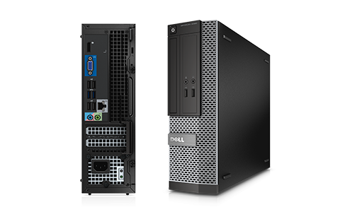
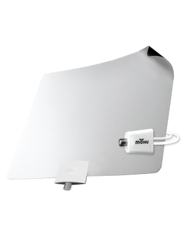

# The Hardware

## A mini-tower with PLEX power

Our first rung on the Cut the Cord Hardware Ladder is something like this:

###- Optiplex 3020

**not an image of the actual machine*

**Internal Hardware - Specs**

We currently have this computer configured with the following specs:

* Intel Pentium Dual-core G3220 @ 3 Ghz
* 8GB RAM
* 2TB Hard Drive
* Hauppage WinTV-HVR-1265 PCI-Express TV Tuner

## External Hardware

To record live TV channels from over-the-air broadcasts, some external hardware is needed.

### - Mohu Leaf - Indoor Antenna

We didn't need 500 mile range on our antenna to get around 20 channels. 

* 60 mile range
* Flat and small
* Runs on USB power if needed